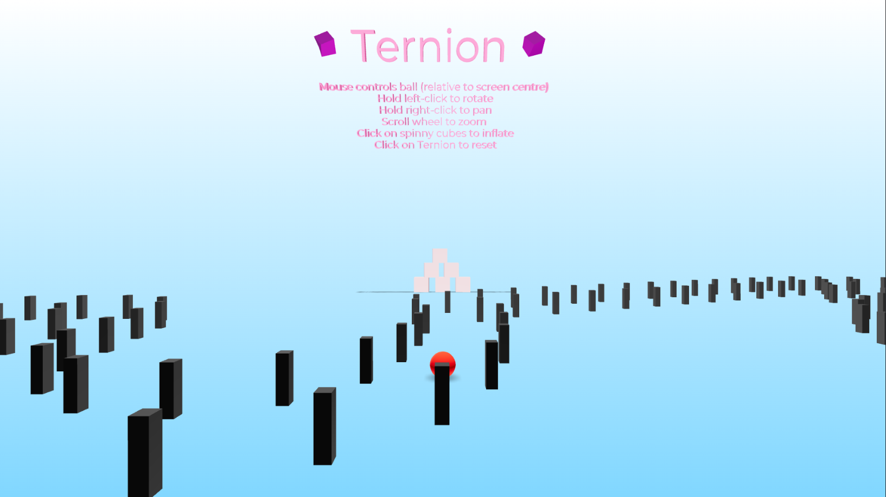
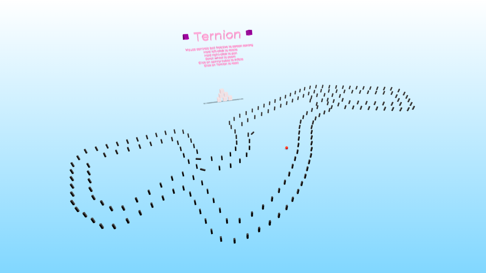
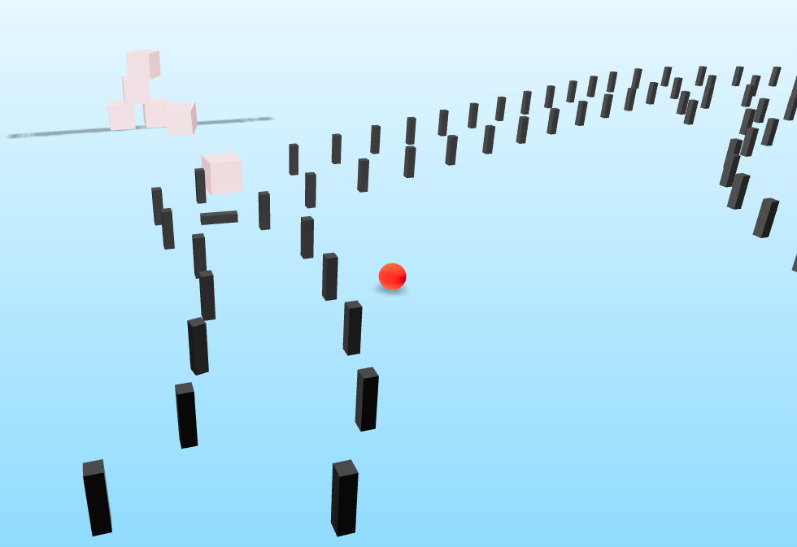

# Ternion
Ternion is a React & three.js app that demonstrates 3D computer graphics in the browser using WebGL. It is a simulation featuring a physics engine, object collision, adjustable camera, lighting and shadows. Roll a ball around a racetrack modelled after a real Formula 1 track while avoiding track obstacles. 

> Load in view and instructions

> Modelled F1 Track

> Physics collisions

## App Instructions
---
- Where the mouse is in the viewport controls the acceleration being applied to the ball.
- Click on the ternion title to restart
- Standard orbit controls: 
    - scroll wheel to zoom
    - left click to rotate
    - right click to pan

## How To Develop Locally
---
This app was built on Node.js and is an Express app. You will need to have Node.js installed to run this web app locally. To install all the dependencies, enter the following lines into the terminal

>`npm init`

>`npm install`

Change in to the Client React app and install all the required dependencies. 

>`cd client`

>`yarn`

>`yarn start`

## Application Deployment 
---
If you are looking to host this on Heroku, within the client folder, update the package.json files inside the client directory with the following scripts:

>` "start": "export SET NODE_OPTIONS=--openssl-legacy-provider && react-scripts start", `

>` "build": "export SET NODE_OPTIONS=--openssl-legacy-provider && react-scripts build", `

There are some compatibility issues with the version of React used for this project which the above scipts solve as of late 2021.

## Architechture
---
Express.js serving the React app.

## Technologies Used
---
### - Node.js
### - Express.js
### - @react-three/cannon
- This library provides an API to simulate physics in a 3D scene
- Different hooks provided for different type of the three.js objects
- `api.applyImpulse` was the main method to move the ball based on mouse movements
### - @react-three/drei
- This library provides a way to implement camera controls for a 3D scene as well as other helper functions for @react-three/fiber
- Typical orbit controls were used
### - @react-three/fiber
- This library allows the use of re-usable, self-contained three.js components that react to state, are readily interactive and can participate in React's ecosystem.
### - react-spring
- This library allows the "spring" effect
### - sass
- An extension to CSS
### - three
- Three.js allows the creation of graphical processing unit (GPU)-accelerated 3D animations using the JavaScript language as part of a website without relying on proprietary browser plugins. This is possible due to the advent of WebGL.

# Features
- 3D scene
- Lighting and shadows
- Physics simulations
- Ball rolling 
- A reaction of the Sochi racetrack (using AutoCAD to generate an .xls file with coordinates, coverted to an array using [Mr. Data Converter](https://shancarter.github.io/mr-data-converter/)

# Potential Future Additions
- Scene optimisations e.g. lighting, shawdows, dynamically loading in physics objects
- Improved interactivity e.g. clicking on objects
- Better use of state e.g. tracking where the ball is in a scene

# Learning References 
- [Threejs-journey](https://threejs-journey.com/)
- [Get started with React and three.js using react three fiber](https://www.youtube.com/watch?v=fdtqqyeKRJk)
- [My other repo with all attempts at learning three.js](https://github.com/vjohndo/three-react)